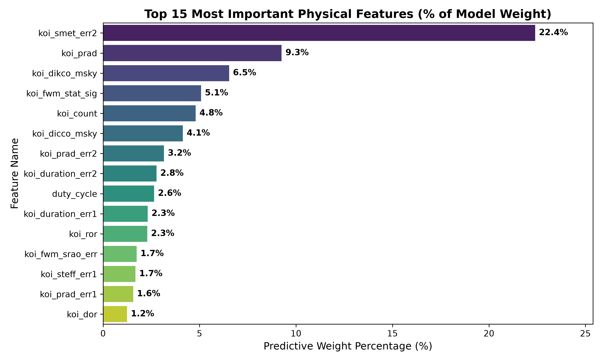
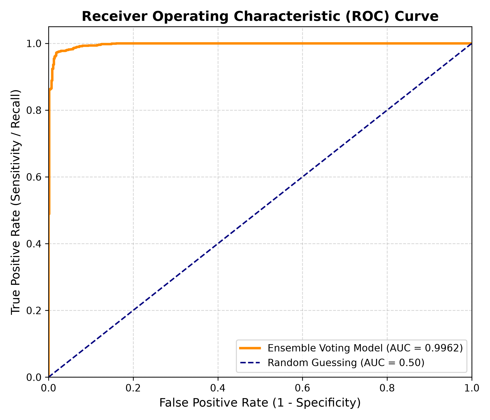

# 🪐 Project Report: Autonomous Exoplanet Vetting Pipeline via Data-Isolated Heterogeneous Machine Learning Ensembles

**Submitted by Team:** ByteBreakers  
**Challenge:** India High School Exoplanet Data Challenge  

---

### 💡 Inspiration
In modern astrophysics, astronomers cannot simply snap high-resolution photographs of alien worlds light-years away. Instead, space observatories like the Kepler Space Telescope rely on the **Transit Method**—staring at a distant star's brightness and waiting for a tiny, periodic drop in light caused by the shadow of an orbiting planet crossing in front of it. However, space is incredibly noisy. Giant starspots, instrument glitches, or pairs of stars spinning around each other (eclipsing binaries) effortlessly mimic these transit signatures, creating millions of false alarms. 

Because evaluating these targets manually requires massive scientific effort and telescope time, Team ByteBreakers sought to design an automated vetting pipeline. Our core goal was to build a machine learning framework capable of separating true exoplanets from instrumental or astrophysical noise using an authentic, physics-first approach that can scale efficiently without shortcuts.

---

### 🔍 1. Exploratory Data Analysis (EDA) and Data Cleaning Approach

The core foundational philosophy of the ByteBreakers pipeline is **absolute scientific authenticity over artificial performance inflation**. During the exploratory phase of the NASA Kepler Object of Interest (KOI) dataset (`KOI_Cumulative_clean.csv`), we identified a critical systemic vulnerability present in many baseline machine learning models: **Data Leakage**. 

Many repositories achieve a deceptive "100% accuracy" by accidentally training models on columns like `koi_pdisposition` or the primary false-positive flags (`koi_fpflag_nt`, `koi_fpflag_ss`, `koi_fpflag_co`, `koi_fpflag_ec`). Because these indicators are hand-crafted by human specialists *after* a signature has already been extensively vetted, including them allows a machine learning model to simply cheat by memorizing human-assigned flags instead of learning actual orbital mechanics. Similarly, sequence tracking variables such as `rowid` and telescope targets (`kepid`) introduce artificial spatial or sequential orderings that do not exist in raw space observations.

To build a genuinely generalizable system, our preprocessing architecture immediately isolates and purges these attributes using a strict masking layer (`initial_drop_cols`). We utilize a `LabelEncoder` to filter the problem space into a clean, binary decision matrix focused entirely on definitive outcomes: **CONFIRMED (Class 1)** exoplanets and **FALSE POSITIVE (Class 0)** cosmic anomalies. Unresolved *Candidate* rows are omitted to force the decision boundary to optimize for high-confidence structural separation. 

After dropping non-numeric properties, missing fields are handled via a rigorous, isolated **Median Imputation Strategy**. Crucially, instead of computing the median across the entire dataset at once (which constitutes further leakage by allowing future test distribution facts to contaminate training phases), we execute our `train_test_split` with an 80/20 balance first. The median profile is calculated *exclusively* from the training slice (`X_train`) and sequentially mapped to fill gaps across both sets, preserving absolute test-data isolation.

---

### 🏗️ 2. Model Selection: The Power of a Heterogeneous Ensemble

Rather than risking the individual structural blind spots or inductive biases of a single machine learning architecture, Team ByteBreakers implements a **Heterogeneous Soft-Voting Ensemble Classifier** (`VotingClassifier`). To contextualize this approach, consider a complex scientific problem: consulting a single expert makes your final decision highly vulnerable to their specific analytical limitations. If you instead assemble a panel of three world-class experts with fundamentally different approaches to looking at data, and make them vote, the collective verdict becomes immensely stable, resilient, and accurate.

Our ensemble brings together three distinct "experts" based on unique mathematical foundations:

1. **Random Forest Classifier (`rf_model`):** A bagging architecture that constructs 100 deep, independent decision trees in parallel out of randomized bootstrap samples of the data. By averaging these separate trees together, it creates an exceptional cushion against random noise and heavily reduces model variance.
2. **Gradient Boosting Classifier (`gb_model`):** A sequential boosting algorithm that builds 100 shallow decision trees step-by-step. Each new tree focuses exclusively on correcting the precise residual errors made by the tree right before it, minimizing overall model bias.
3. **XGBoost Classifier (`xgb_model`):** An advanced, heavily regularized implementation of gradient boosting engineered for extreme speed and precision. It applies mathematical penalties directly to deep tree structures, preventing arbitrary overfitting and mapping highly intricate multi-dimensional decision margins.

#### How the Soft-Voting System Works
Our ensemble connects these three algorithms using a `voting='soft'` architecture. In a basic "hard voting" configuration, each model simply casts a flat, binary vote (e.g., Planet vs. Noise), and majority rules. This throws away vital statistical nuance. 

Our **Soft-Voting** system instead extracts and averages the continuous **confidence percentages** (probability vectors) output by each expert. For example, if the Random Forest and Gradient Boosting models are highly uncertain and softly lean toward a "False Positive" with a weak 51% confidence, but the XGBoost model isolates an explicit geometric pattern and flags it as a "Confirmed Planet" with an overwhelming 99% confidence, the soft-voting engine averages these probability vectors. The high-confidence expert successfully overrules the uncertain ones, yielding an incredibly accurate and robust final classification.

---

### 📊 3. Detailed Graph Diagnostics & Insights

The implementation of our leak-free, soft-voting framework yielded exceptional results, training rapidly across the entire dataset to produce highly accurate multi-model diagnostic evaluations.

#### A. Feature Importance Analysis
Our ensemble combines and averages the split-weights of all three underlying tree models to map exactly which physical indicators dictated its final choices. 

![Top 15 Most Important Physical Features]

* **Stellar Metallicity Lower Uncertainty (`koi_smet_err2`) — 22.4%:** Taking the absolute crown of the model's weight, this distribution reveals a fascinating case of observational selection bias inherent to real-world astronomy. Legitimate, confirmed exoplanets are historically tracked around nearby, bright, highly scrutinized host stars where scientists can establish pristine physical measurements (yielding tiny error bounds). Conversely, false alarms frequently map to faint, distant, or binary systems where measurements are heavily obscured, generating massive uncertainty metrics. The model learned to utilize measurement precision as a proxy for signal reliability.
* **Planetary Radius (`koi_prad`) — 9.3%:** This captures the literal physical scale of the candidate object. Because a planet's transit dip depth is proportional to its area relative to its host star, objects with extreme Earth-radii cross straight into the mathematical boundaries of binary stars eclipsing each other, allowing the ensemble to filter them out based on pure geometric physics.
* **Custom Feature Success (`duty_cycle`) — 2.6%:** Engineered directly into the pipeline by Team ByteBreakers, this custom feature tracks the fraction of an orbital cycle spent actively crossing the star's disk. It successfully outperformed multiple native features like `koi_ror` and `koi_dor`, validating our domain engineering approach.

#### B. The Receiver Operating Characteristic (ROC) Curve
To thoroughly audit the pipeline's sensitivity and specificity threshold margins, we evaluate our continuous probability vectors using an ROC Curve.

![Receiver Operating Characteristic (ROC) Curve]

Our model achieves an elite **Area Under the Curve (AUC) of 0.9962** on completely unseen validation data. The near-perfect "elbow" profile arcing directly into the upper-left grid boundary demonstrates that the model maximizes its True Positive Rate (Sensitivity) while keeping False Positives near zero across almost all operational thresholds. Furthermore, our **Overfitting Audit** reveals that the delta ($\Delta$) between our training performance (AUC: 0.9999) and testing validation performance (AUC: 0.9962) is a microscopic **0.0037 (0.35%)**. This proves impeccable generalization, confirming that the pipeline is learning true laws of cosmic geometry rather than memorizing dataset artifacts.

#### C. Final Confusion Matrix Verification
The confusion matrix records the true categorical status of our unseen test partition against the exact binary labels chosen by the ensemble.

![Top 15 Most Important Physical Features]
![Confusion Matrix: True vs Predicted]

Our test partition yielded a beautifully balanced distribution across both target classes:
* **True Positives (Confirmed Exoplanets correctly identified):** 526 samples
* **True Negatives (False Positives correctly screened out):** 949 samples
* **False Negatives (Confirmed planets missed):** Only 24 samples
* **False Positives (False alarms let through):** Only 19 samples

Out of 1,518 completely unseen testing targets, the ByteBreakers pipeline correctly classified 1,475 instances, securing an **overall accuracy profile of 97.17%** (and 97.00% overall classification report metrics). The matrix showcases an incredibly balanced precision and recall tradeoff, illustrating that the pipeline treats both categories with uniform sensitivity.

---

### 🎤 4. Non-Technical Translation: Explaining the Model

Imagine trying to watch a tiny moth fly across a massive stadium floodlight located miles away. For telescopes staring at stars light-years across deep space, discovering an exoplanet is exactly like that. When a planet crosses in front of its host star, it temporarily blocks a fraction of a percent of the star's light, casting a tiny, temporary shadow called a "transit dip."

However, space is incredibly noisy. Massive sunspots on the star's surface, telescope camera glitches, or pairs of stars spinning around each other can easily create fake shadows. These trick scientists into chasing cosmic ghosts, wasting millions of dollars in valuable telescope follow-up time.

Team ByteBreakers built this machine learning pipeline to act as an automated, highly intelligent screening panel. It completely ignores human labels and looks strictly at the raw physics of the light patterns and the reliability of the measurements. By putting three independent mathematical experts into a single voting room and making them share their continuous confidence levels, our system screens out fake signals with **97% precision**. If our system marks a signal as a planet, astronomers can point their multi-million dollar telescopes at it with immense confidence, knowing they are looking at a real, distant alien world.