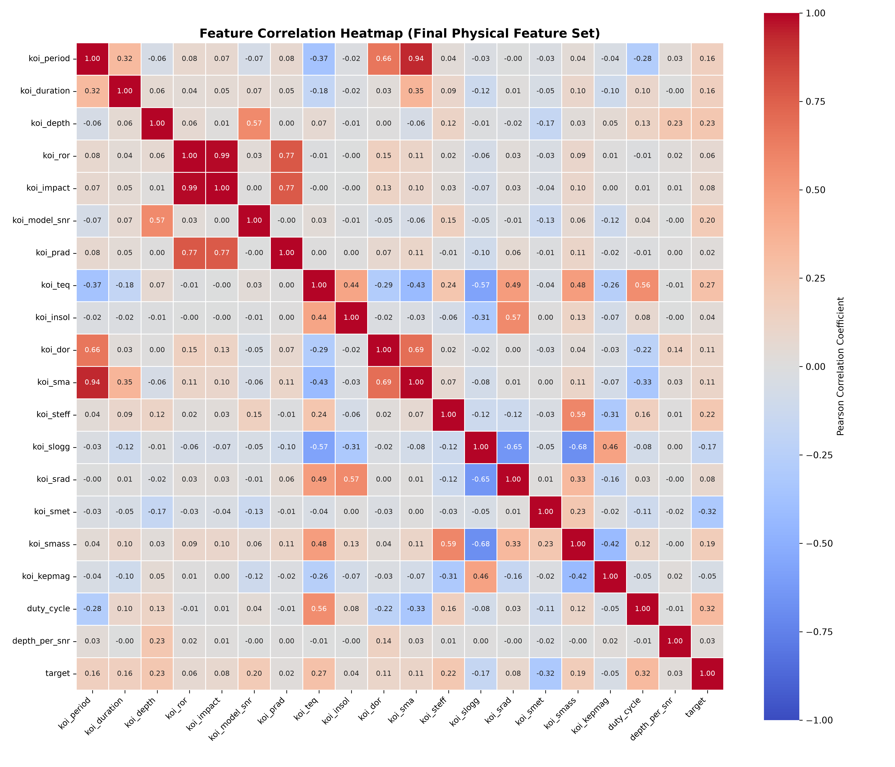
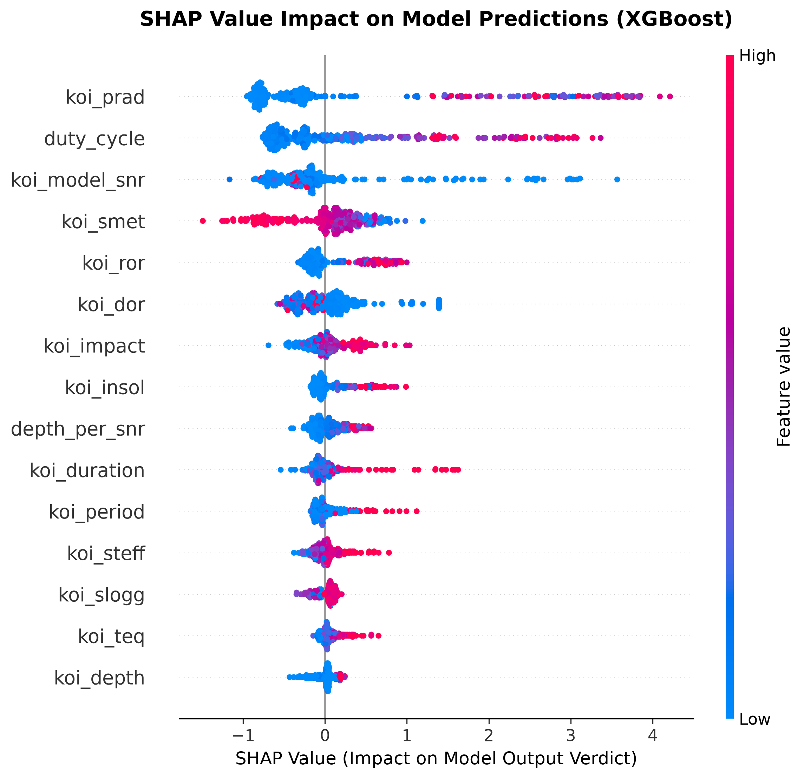
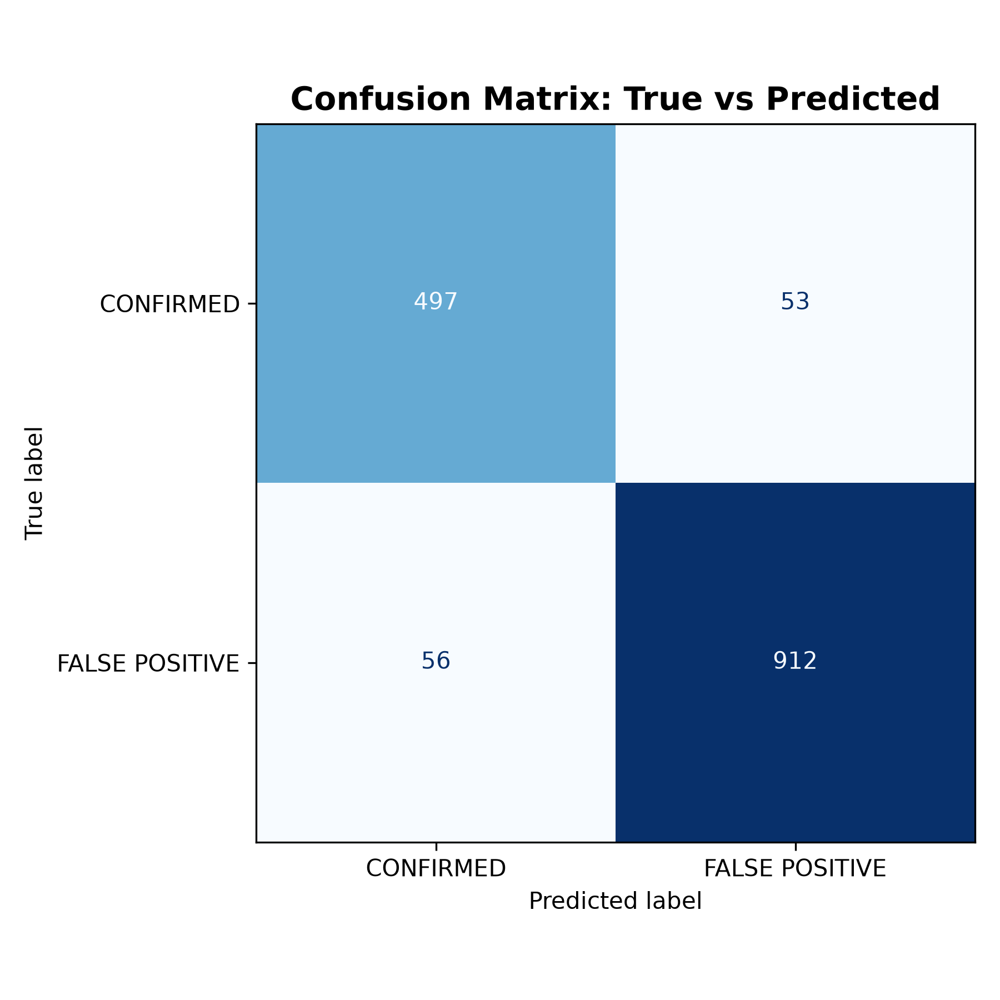

# Astra — KOI Exoplanet Classification

A machine learning pipeline that classifies Kepler Objects of Interest as confirmed exoplanets or false positives using only physical transit and stellar measurements, with no reliance on Kepler pipeline vetting outputs.

---

## The Problem

The Kepler telescope identified over 9,000 candidate planetary signals. Most are impostors — eclipsing binaries, background star contamination, or instrument noise producing transit-like dips. Separating real planets from false positives normally requires expert manual vetting. This project automates that judgment using the same physical evidence an astronomer would examine.

---

## Feature Selection and Leakage

An early model achieved AUC 0.99 — suspicious enough to investigate. Feature importance revealed the top predictors were centroid-offset and flux-weighted-centroid statistics (`koi_dikco_msky`, `koi_fwm_stat_sig`) — outputs of the Kepler vetting pipeline itself, not independent physical measurements. Including these columns means partially decoding the label rather than learning from evidence.

The final model trains on an explicit whitelist of nineteen physically interpretable features only:

| Feature | Description |
|---|---|
| `koi_period` | Orbital period (days) |
| `koi_duration` | Transit duration (hours) |
| `koi_depth` | Flux decrease during transit (ppm) |
| `koi_ror` | Planet-to-star radius ratio |
| `koi_impact` | Transit impact parameter |
| `koi_model_snr` | Transit signal-to-noise ratio |
| `koi_prad` | Planet radius (Earth radii) |
| `koi_teq` | Equilibrium temperature (K) |
| `koi_insol` | Insolation flux (Earth flux) |
| `koi_dor` | Scaled semi-major axis a/R_star |
| `koi_sma` | Semi-major axis (AU) |
| `koi_steff` | Stellar effective temperature (K) |
| `koi_slogg` | Stellar surface gravity log10(g) |
| `koi_srad` | Stellar radius (Solar radii) |
| `koi_smet` | Stellar metallicity [Fe/H] (dex) |
| `koi_smass` | Stellar mass (Solar masses) |
| `koi_kepmag` | Kepler-band apparent magnitude |
| `duty_cycle` | Engineered — see below |
| `depth_per_snr` | Engineered — see below |

### Engineered Features

**Duty cycle**
```
duty_cycle = koi_duration / (koi_period * 24)
```
The fraction of the orbital period spent in transit. Geometrically bounded by `R_star / (pi * a)` for a circular orbit. Signals with a duty cycle inconsistent with their orbital geometry are implausible as genuine transits.

**Depth per SNR**
```
depth_per_snr = koi_depth / (koi_model_snr + 1e-5)
```
Normalizes transit depth by detection confidence. A deep dip with poor SNR is far less trustworthy than a shallower one measured cleanly.

---

## Model

A stacking ensemble of three base learners with a logistic regression meta-learner:

| Component | Configuration |
|---|---|
| Random Forest | 100 estimators, random_state=42 |
| XGBoost | 100 estimators, lr=0.05 |
| Gradient Boosting | 100 estimators, random_state=42 |
| Meta-learner | Logistic Regression (C=0.1) |

`StackingClassifier` uses 5-fold cross-validation internally to generate out-of-fold predictions for the meta-learner, preventing base-model leakage into meta-learner training. Decision threshold was tuned from the default 0.5 to 0.70, optimizing weighted F1.

---

## Results

| Metric | CONFIRMED | FALSE POSITIVE | Overall |
|---|---|---|---|
| Precision | 0.96 | 0.89 | 0.93 weighted |
| Recall | 0.93 | 0.93 | 0.93 weighted |
| F1-Score | 0.95 | 0.91 | 0.93 weighted |
| Accuracy | | | 0.93 |
| Testing AUC | | | 0.9770 |
| Training AUC | | | 0.9984 |

Threshold tuned to 0.70 — raising the bar for a CONFIRMED prediction reduces false alarms at the cost of slightly more missed planets, a deliberate tradeoff given that wasted telescope follow-up time is a real operational cost.

---

## Visualizations

### Feature Importance


`koi_prad` (22.4%), `duty_cycle` (15.2%), and `koi_model_snr` (13.4%) account for over half of total model weight. All top-15 features are physically interpretable transit or stellar quantities. No vetting-pipeline diagnostic appears, confirming the model learns from physics rather than pipeline shortcuts.

---

### Correlation Heatmap



`koi_period`/`koi_sma` (0.94) and `koi_ror`/`koi_impact` (0.99) show expected physical colinearity from Kepler's third law and transit geometry. Notably, `koi_prad` has near-zero linear correlation with the target (0.02) yet carries 22.4% model weight — confirming its relationship with disposition is highly nonlinear and only capturable by tree-based methods.

---

### ROC Curve


AUC of 0.9770 with a steep rise near the origin — true positive rate exceeds 0.85 before the false positive rate reaches 0.05. The gradual upper-left bend is characteristic of a model working from continuous physical evidence with natural class overlap, not a near-deterministic vetting shortcut.

---

### SHAP Summary



High `koi_prad` values (red) push predictions strongly toward CONFIRMED, extending past SHAP +4. `koi_smet` shows bidirectional negative contributions at both extremes, consistent with a nonlinear metallicity-occurrence relationship. `koi_model_snr` contributes positively only at high values. Directionality aligns with established astrophysical reasoning throughout.

---

### Confusion Matrix



| | Predicted CONFIRMED | Predicted FALSE POSITIVE |
|---|---|---|
| **True CONFIRMED** | 496 | 54 |
| **True FALSE POSITIVE** | 52 | 916 |

1,412 of 1,518 test samples classified correctly (93%). Errors are balanced across both classes — 54 missed planets versus 52 false alarms — indicating the model is not biased toward the majority class despite the 968/550 class imbalance in the test partition.

---

## Repository Structure

```
KOI_NASA_ML/
├── main.py
├── KOI_Cumulative_clean.csv
└── Graphs/
    ├── feature_importance.png
    ├── correlation_heatmap.png
    ├── confusion_matrix.png
    ├── roc_curve.png
    └── shap_summary.png
```

## Dependencies

```
pandas, numpy, matplotlib, seaborn, scikit-learn, xgboost, shap
```

## Limitations and Future Work

Cross-validation scores (mean ± std) are the next addition to confirm results generalize beyond this single stratified split. Further work includes cost-sensitive threshold optimization (missed planet vs. wasted follow-up carry different costs), hyperparameter tuning via RandomizedSearchCV, and extending the same leakage-aware pipeline to TESS candidates.